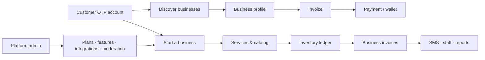
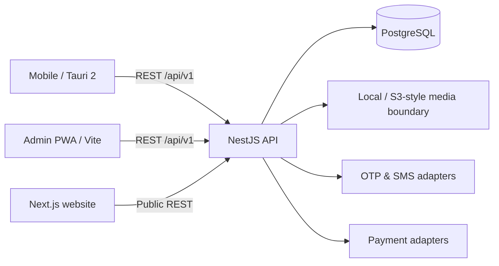

<p align="center">
  
</p>

<h1 align="center">Karban Platform</h1>

<p align="center"><strong>Persian-first service marketplace and business operating system for Iran.</strong></p>

<p align="center">
Customer discovery · Business onboarding · Catalog · Inventory · Invoicing · Payments · Wallets · SMS · Platform administration
</p>

> [!IMPORTANT]
> Karban is an implementation-stage product platform, not a production certification. Major product slices are present in source, but a real deployment still needs provider credentials, environment hardening, dependency-backed builds/tests, monitoring, backups, and current legal/compliance review.

## What is Karban?

Karban connects the two sides of a local service business in one platform:

- **Customers** can register by mobile OTP, discover businesses, inspect services and reviews, receive invoices, pay, use a wallet, and interact with loyalty features.
- **Business owners** can turn an existing customer account into a business profile, manage branding and verification, build a service catalog, track stock movements, issue invoices, configure payment methods, control SMS, request staff access, and review reports.
- **Platform operators** get an administration console for users, businesses, plans, feature flags, integrations, SMS policy, verification, reviews, payments, wallets, reports, audit data, and platform controls.
- **Public visitors** get a Persian marketing site and server-rendered business directory with SEO metadata and structured business data.

Plumbing is the first seeded business type. The domain is intentionally modeled around generic `BusinessType`, catalog, plan, feature, and entitlement concepts so other service categories can be added without creating a separate platform.

## Product surfaces

| Surface | Audience | Stack | Role |
| --- | --- | --- | --- |
| [`backend/`](backend/README.md) | All clients | NestJS 11, Prisma 6, PostgreSQL 16 | Versioned REST API, business rules, provider adapters, scheduled jobs |
| [`mobile/`](mobile/README.md) | Customers, owners, staff | React 19, Vite 7, Tauri 2 | Persian/RTL customer app and business operating experience |
| [`admin/`](admin/README.md) | Platform operators | React 19, Vite 7, TanStack Query | Local-first PWA administration console |
| [`website/`](website/README.md) | Public visitors | Next.js 16 | Marketing site, verified-business directory, public profiles |
| [`karban-developer-console/`](karban-developer-console/README.md) | Developers/operators | Bash + existing project tools | One-command control center for local development and diagnostics |
| [`docs/`](docs/README.md) | Contributors | Markdown | Architecture, security, providers, product scope, operations |

These are **independent applications sharing an HTTP contract**, not a package-manager monorepo.

## Experience at a glance



### Customer journey

- Iranian mobile-number OTP registration with an API.ir OTP/CallOTP adapter.
- Nearby/search discovery and public business profiles.
- Services, availability foundations, verification badges, and customer-owned reviews.
- Customer invoices, render download/regeneration flows, online payment, wallet, notifications, and loyalty foundations.

### Business journey

- Step-by-step onboarding: identity → business details → location → branding → payment details → catalog → preferences.
- Service/category catalog and stock-movement inventory ledger.
- Registered-customer validation before invoice creation.
- Invoice item snapshots plus PDF/PNG render artifacts with scheduled expiry.
- Business payment methods, wallet, SMS controls, staff requests, reporting, plans, and feature entitlements.

### Platform operations

- User/business freezes, plans, limits, feature flags and per-business overrides.
- Encrypted integration configuration with provider-specific adapters.
- SMS pricing and `AUTO / REVIEW / DISABLED` policy controls.
- Verification, review moderation, payments, wallets, reports, staff requests, and audit-oriented admin flows.
- PWA update handling with a waiting-service-worker update prompt.

## Iran-focused foundations

Karban is not a generic western SaaS template with Persian text added later. The source already includes several Iran-specific boundaries:

- Persian/RTL-first client experience.
- Iranian mobile OTP provider integration through API.ir adapters.
- ZarinPal payment-provider adapter.
- Iranian invoice/tax identifier fields and extensible tax-provider boundary.
- Rial-oriented wallet/payment concepts and configurable loyalty mechanics.
- eNamad placement component on the public website.
- Provider credentials managed as encrypted integration configuration rather than committed source secrets.

Direct submission to Iran's Taxpayer System is **not** presented as completed. A production deployment should connect a certified/current provider behind the existing tax integration boundary after legal and compliance review.

## Architecture



The backend keeps vendor-specific behavior behind provider boundaries while the application domain remains centered on users, businesses, catalogs, inventory, invoices, wallets, reviews, messaging, entitlements, and platform policy.

## Quick start

### Option A — Docker workspace

The root Compose file starts PostgreSQL, the API, the admin PWA, and the public website with safe local-development defaults:

```bash
git clone https://github.com/Mobin-Karam/karban-platform.git
cd karban-platform
docker compose up --build
```

Default local endpoints:

| Service | URL |
| --- | --- |
| API | `http://localhost:4000/api/v1` |
| Admin | `http://localhost:5174` |
| Website | `http://localhost:3001` |
| PostgreSQL | `localhost:5432` |

The mobile client is intentionally run separately because native Tauri targets require platform toolchains.

### Option B — Run applications separately

Start with [`docs/development.md`](docs/development.md). In short:

```bash
# API
cp backend/.env.example backend/.env
cd backend
npm ci
npx prisma generate
npm run prisma:deploy
npm run prisma:seed
npm run dev
```

Then run the desired client from its own directory with its checked-in `.env.example`.

## Developer console

Karban includes an optional Bash control center that wraps the separate projects without turning them into a monorepo:

```bash
cd karban-developer-console
chmod +x install.sh
./install.sh

cd ..
karban
```

It provides project overview, workspace controls, Prisma/database workflows, Docker, backend/admin/mobile/website actions, integration diagnostics, builds, releases, logs, support bundles, and Android tooling.

See [`karban-developer-console/README.md`](karban-developer-console/README.md).

## Security model

Three bootstrap values must remain outside the database:

- `DATABASE_URL`
- `JWT_SECRET`
- `CONFIG_ENCRYPTION_KEY`

Provider credentials can be stored as encrypted `IntegrationConfig` records. The configuration encryption key itself must **not** be stored beside the encrypted values.

Other implemented safeguards include hashed/expiring OTPs, JWT guards, admin-role guards, validation pipes, CORS allowlists, throttling, verified payment callbacks, transactional money paths, server-resolved invoice pricing, upload limits/type checks, and audit-oriented admin actions.

Read [`docs/security.md`](docs/security.md) before exposing any environment publicly.

## Repository map

```text
karban-platform/
├── backend/                   NestJS + Prisma API
├── mobile/                    React + Tauri customer/business app
├── admin/                     React/Vite administration PWA
├── website/                   Next.js public website and directory
├── karban-developer-console/  Developer/operator CLI
├── docs/                      Product and engineering documentation
├── assets/                    Shared repository branding
└── docker-compose.yml         Local multi-service workspace
```

## Documentation

Start with the [documentation index](docs/README.md), then use these references as needed:

- [Product scope](docs/product-scope.md)
- [Implementation status](docs/IMPLEMENTATION_STATUS.md)
- [Architecture](docs/architecture.md)
- [Local development](docs/development.md)
- [Environment and secrets](docs/environment.md)
- [Security](docs/security.md)
- [Iranian invoice & inventory model](docs/iranian-invoice-inventory.md)
- [Payments & wallets](docs/payments-wallets.md)
- [SMS & OTP](docs/sms-otp.md)
- [API conventions](docs/api-conventions.md)
- [Extensibility](docs/extensibility.md)
- [Build verification notes](docs/BUILD_AUDIT.md)

## Product showcase

The repository intentionally does **not** publish fabricated app screenshots. The marketing website already contains media slots so release screenshots and video can be added when they come from a real running build.

Until then, the best product walkthrough is the implemented surface itself:

- Customer/business screens: [`mobile/src/pages/`](mobile/src/pages/)
- Platform operations: [`admin/src/pages/`](admin/src/pages/)
- Public experience: [`website/app/`](website/app/)
- Backend domains: [`backend/src/modules/`](backend/src/modules/)

This keeps the repository presentation credible: real source first, polished release media when it exists.

## Verification and production readiness

The repository contains an initial Prisma migration and source-level audit tooling. The historical packaging audit could not run dependency-backed builds or native Tauri builds in its environment, so those checks are not claimed as universally passing.

Before production deployment, run the commands in [`docs/BUILD_AUDIT.md`](docs/BUILD_AUDIT.md) on the target toolchain and validate all external-provider, storage, backup, observability, and compliance requirements.

## Contributing

Contributions that improve product correctness, provider isolation, accessibility/RTL behavior, documentation, tests, and operational safety are welcome. Read [`CONTRIBUTING.md`](CONTRIBUTING.md) before opening a pull request.
