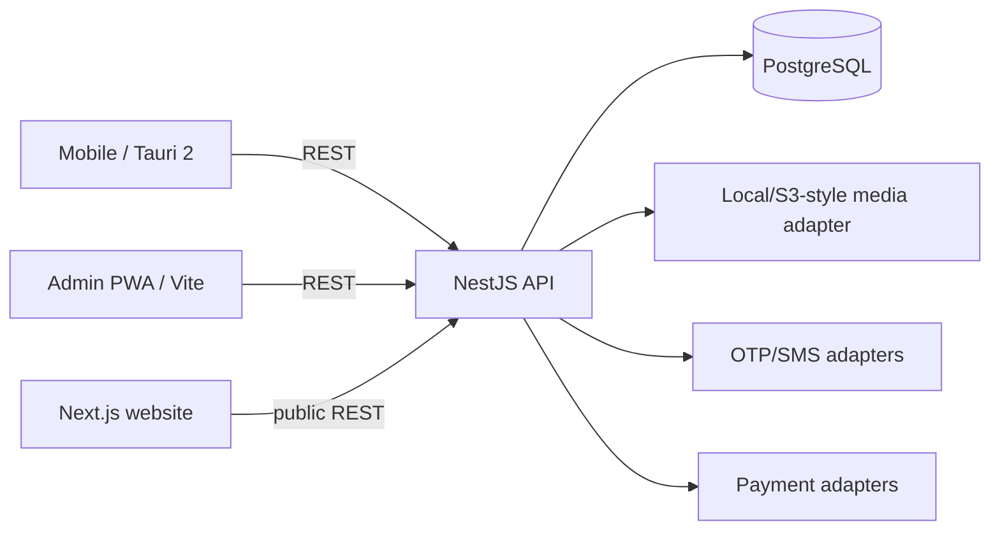

# Architecture

Karban is four independent applications sharing an HTTP contract, not a package-manager monorepo.

## Domain boundaries

- Identity: customer-first `User`, profile, OTP challenge.
- Business: generic `BusinessType`, `Business`, membership and staff request.
- Catalog: service category + service. Invoice service lines resolve from catalog before issue.
- Inventory: category, item, movement ledger.
- Billing: invoice, immutable item snapshots, expiring render artifacts.
- Money: wallets, ledger transactions, payment attempts, business payment methods.
- Engagement: reviews, reports, messages, SMS and notifications.
- Growth: plans, feature flags/overrides, limits, loyalty levels, coin rules/grants.
- Platform: encrypted integration configuration and audit records.

Modules communicate through IDs/provider interfaces rather than importing another vendor implementation. Plumbing is the seeded business type, not a special-case table structure.
